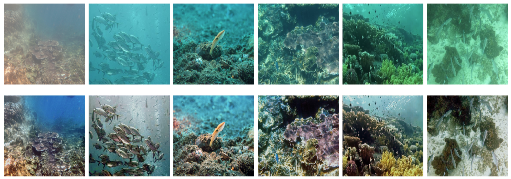

# HUWIE-Net (Hybrid Underwater Image Enhancement Network)

This is an open-source underwater image enhancement method developed using PyTorch. If you use our code, please consider citing our paper.

Top row: real-world underwater images , bottom row: the corresponding enhanced images by HUWIE-Net.

# Dataset
The dataset used in this project is the [UIEB Dataset](https://li-chongyi.github.io/proj_benchmark.html)

# Working Directory
The working directory structure is organized as follows:

...

# Requirements
The packages used are listed below. All dependencies are provided in the requirements.txt file.  

python==3.12.7  
spyder==5.5.1  
pytorch==2.3.1  
tensorboard==2.17.0  
opencv==4.10.0  
pillow==11.0.0  
torchvision==0.18.1  

# Testing

python test.py

# Training

python train.py

# Citation

Evaluating...

# Contact

If you have any questions, please feel free to contact us at ozandemir22651@gmail.com.

